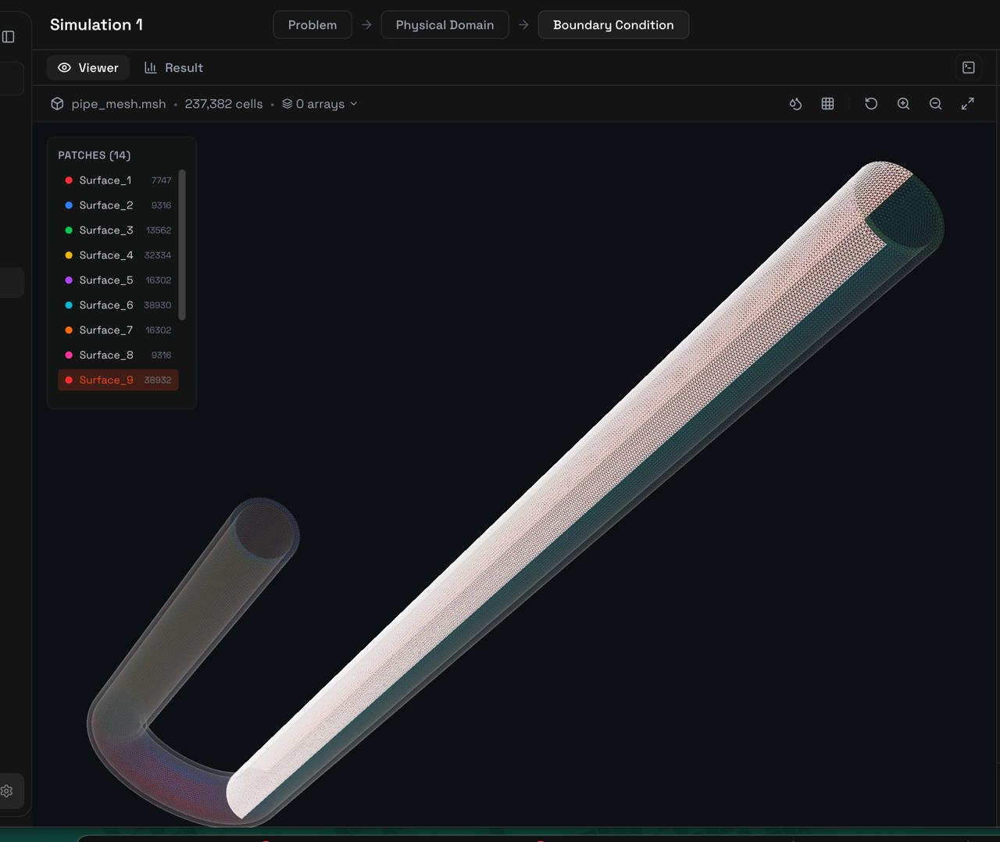

# Detailed Analysis Approach for LN2 U-Shaped Pipe Multiphase Flow



## Problem Overview

simulating a **cryogenic multiphase flow** problem where liquid nitrogen (LN2 at 77K) enters a U-shaped pipe with walls at 400K. This creates significant boiling and phase change phenomena. This is a complex problem requiring transient multiphase simulation with heat transfer and phase change modeling.

## Detailed Analysis of Each Objective

### 1. **Multiphase Phenomenon & Flow Regimes**

For LN2 boiling in the pipe, you'll encounter multiple flow regimes:
- **Bubbly flow**: Small vapor bubbles dispersed in liquid (initial phase)
- **Slug flow**: Large vapor bubbles occupying pipe cross-section
- **Annular flow**: Liquid film on walls with vapor core
- **Mist flow**: Droplets in vapor stream (near outlet)

The flow regime depends on void fraction (α), which changes along the pipe length due to heat input from hot walls.

**Analysis Method**: Track phase fraction (alpha) spatially and temporally. Visualize using iso-surfaces and contour plots.

### 2. **Pressure Drops**

Pressure drop has multiple components:
- **Frictional losses**: Due to wall shear (single-phase and two-phase multipliers)
- **Acceleration pressure drop**: Due to phase change (liquid→vapor density change)
- **Gravitational pressure drop**: Hydrostatic head in U-bend
- **Form losses**: At bends and geometry changes

**Analysis Method**: Monitor pressure at multiple locations (inlet, mid-height, U-bend bottom, outlet). Calculate ΔP = P_inlet - P_outlet.

### 3. **Fill Time**

Time for liquid to completely fill the column from initial condition to steady flow:
- Initially, pipe may be empty or contain gas
- Liquid front propagates based on inlet velocity and gravity
- Complicated by simultaneous boiling and vapor generation

**Analysis Method**: Track liquid volume fraction integral over entire domain vs time: V_liquid(t) = ∫α·dV. Fill complete when V_liquid stabilizes.

### 4. **Saturation State Time**

Time to reach thermal equilibrium where:
- Liquid temperature reaches saturation temperature (77K at local pressure)
- Vapor generation rate stabilizes
- Temperature field becomes quasi-steady

**Analysis Method**: Monitor temperature and phase change rate. Saturation reached when ∂(mass_vapor)/∂t becomes constant.

### 5. **Boil-off Losses**

Mass of liquid that vaporizes per second due to wall heat input:
- Heat flux from 400K wall to 77K fluid
- Energy balance: Q = ṁ_vapor × h_fg
- Where h_fg is latent heat of vaporization for LN2 (~200 kJ/kg)

**Analysis Method**: Calculate vapor generation rate: ṁ_boiloff = ∫(ρ_vapor × U_vapor · n)dA at outlet or track phase change source term.

## OpenFOAM Solver Selection

For this problem, you need a multiphase solver with:
- Phase change modeling (boiling/condensation)
- Heat transfer
- Compressibility effects (high pressure)

**Recommended solvers**:
- `icoReactingMultiphaseInterFoam`: Multiphase with phase change
- `reactingTwoPhaseEulerFoam`: Eulerian multiphase with reactions
- `multiphaseEulerFoam`: Multiple Eulerian phases

## Python Code Implementation

Based on the **Foam-Agent** framework 

1. **Generates a user requirement file** for Foam-Agent to automatically set up the OpenFOAM case
2. **Creates post-processing scripts** to extract all the objectives

### Code Part 1: Generate User Requirement for Foam-Agent

```python
"""
LN2 U-Pipe Multiphase Flow - Foam-Agent User Requirement Generator
This script creates a detailed requirement file for Foam-Agent to set up
the OpenFOAM simulation automatically.
"""

def generate_user_requirement():
    """Generate user requirement text file for Foam-Agent"""
    
    requirement = """
# LN2 U-Shaped Pipe Multiphase Boiling Simulation

## Geometry
- U-shaped pipe with two vertical limbs facing upwards
- Internal diameter: 25 mm
- Wall thickness: 2.5 mm
- Material: Stainless steel

## Fluid Properties
- Operating fluid: Liquid Nitrogen (LN2)
- Two phases: liquid and vapor
- Liquid properties at 77K:
  * Density: 808 kg/m³
  * Viscosity: 1.58e-4 Pa·s
  * Thermal conductivity: 0.14 W/m·K
  * Specific heat: 2040 J/kg·K
- Vapor properties at 77K:
  * Density: 4.6 kg/m³ (at 4 bar)
  * Viscosity: 5.5e-6 Pa·s
- Latent heat of vaporization: 199 kJ/kg
- Saturation temperature: 77K at 1 bar (adjust for 4 bar)

## Boundary Conditions
- Inlet (shorter limb, bottom):
  * Fixed velocity corresponding to mass flow rate 89 g/s
  * Velocity = (0.089 kg/s) / (808 kg/m³ × π × (0.0125m)²) ≈ 0.224 m/s
  * Temperature: 77K
  * Pressure: 4 bar (400 kPa)
  * Phase: pure liquid (alpha.liquid = 1)
  
- Outlet (top of longer limb):
  * Pressure outlet or outflow condition
  * Zero gradient for other fields
  
- Walls:
  * No-slip condition (U = 0)
  * Fixed temperature: 400K
  * Heat transfer from wall to fluid enabled

## Initial Conditions
- Pressure: 4 bar throughout domain
- Temperature: 77K in fluid domain
- Velocity: zero everywhere
- Phase: can start with empty pipe or pre-filled liquid

## Solver Requirements
- Use multiphase solver with phase change capability (icoReactingMultiphaseInterFoam or reactingTwoPhaseEulerFoam)
- Enable heat transfer and phase change modeling
- Include buoyancy effects (gravity in vertical direction)
- Transient simulation

## Simulation Parameters
- Time step: adaptive based on Courant number (max Co = 0.5)
- End time: sufficient for filling and reaching steady state (suggest 10-30 seconds)
- Write interval: every 0.1 seconds for detailed analysis
- Turbulence: laminar or k-epsilon if Reynolds number warrants

## Output Requirements
Track the following fields at each time step:
- Pressure (p)
- Velocity (U)
- Temperature (T)
- Phase fraction (alpha.liquid, alpha.vapor)
- Phase change rate
- Heat flux at walls

## Objectives
1. Identify multiphase flow regimes (bubbly, slug, annular, mist)
2. Calculate pressure drop from inlet to outlet
3. Determine fill time (time for liquid to fill entire column)
4. Find time to reach saturation state (thermal equilibrium)
5. Calculate boil-off losses (mass of liquid vaporizing per second)

